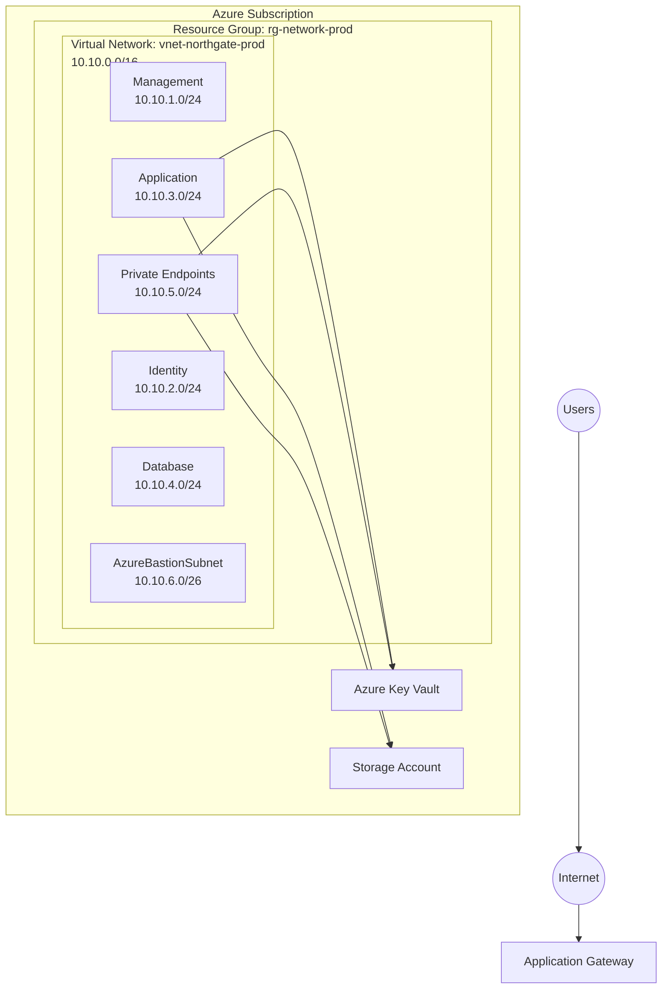

# Northgate University Azure Environment

This directory documents the architecture used throughout the Azure Security Labs.

Rather than deploying isolated resources, every lab contributes to a single enterprise environment that evolves.

The environment follows Microsoft Cloud Adoption Framework recommendations while remaining cost-effective enough to run within an Azure Free Trial subscription.

